# Mudae Noter

A web-based tool to view, organize, and note your Mudae collection.
Designed for use with the [Mudae bot](https://top.gg/bot/432610292342587392) on Discord.

**Use it now:** [mir-khan.github.io/mudae-noter](https://mir-khan.github.io/mudae-noter/) - no install, nothing to download.

> This is a fork of [Arczeus/mudae-noter](https://github.com/Arczeus/mudae-noter) with a large set of collection-management features layered on top - see [What's New in This Fork](#whats-new-in-this-fork) below.

## Features

- Import your collection from the `$mmsaty+ri-c+x+ko` command and show characters with their images, series, kakera, and key values.
- Manage multiple collections at once - create, duplicate, rename, delete, and switch between them.
- Group and sort characters by series, note, color, keys, kakera, gender, roulette, or owner; filter by kakera/key range, owner, gender, roulette, Imgur status, or disabled-only series.
- A ranking system to number characters, with drag-and-drop or click-a-badge reordering.
- Bulk-apply notes or hex colors to entire series or selected groups, or add a key count to one character directly.
- Click a character's picture to generate a Mudae `$ims` command, paste the whole DM back in, and pick visually from a thumbnail grid - each pick generates the matching `$c` command to make it the active image.
- Upload a new image in-app (via [ImgChest](https://imgchest.com/)) tied to that character - get both the `$ai` command to add it and the `$c` command to activate it, with a confirm button that updates the app once you've run it.
- Crop an image (including animated GIFs, with the animation preserved) to 225×350 - the size Mudae's own images use - before uploading, with drag-to-pan and zoom, and an optional colored border (white by default, matching the slight edge Mudae's own images already show once Discord embeds them).
- Automatically creates optimized `$n`, `$ec`, `$ai`, `$c`, `$sm`, `$smpos`, `$smseries`, and `$smnote` commands ready to paste back into Discord.
- Compare two collections, or transfer notes or colors from one collection onto matching characters in another.
- Reorder your whole collection - drag-and-drop, jump-to-position, or select-and-move multiple at once - with detailed/compact/grid views and search/filtering.
- Reorder series the same way, with each series pictured by its highest-kakera character.
- Sort your collection by note directly from the Notes tab - drag your notes into a priority order and generate a `$smnote` command.
- Pick colors visually with a color wheel on the **Colors** tab, scoped to your keyed characters, with a "No Color Only" filter to find who's still missing one.
- Add just your newest characters without re-pasting your whole collection - the **+ Add New Characters** popup walks you through Mudae's "not noted" filter, merges the result in, and offers a quick note field for each new arrival.
- Quick Notes sidebar - save reusable notes, emojis, or hex colors for fast copy-paste, reorderable by drag-and-drop, and reachable from the new-character note prompt too.
- A "Recently Noted" panel tracks who you've just tagged (since applying a note to your selection clears it afterward, ready for the next batch), with click-to-jump chips and its own scoped `$n` command.
- A "missing from Sort tab" indicator flags Notes-tab characters with no matching entry in your last `$mmmka+s` paste, so nobody silently disappears from Sort tab search.
- After running a generated `$sm`/`$smseries`/`$smnote`/color command in Discord, confirm it worked to lock that order/color in as the app's new baseline - no need to re-import to keep everything in sync.
- Save your own and your friends' `$wishlist` output on the **Wishlists** tab, and compare any two to see exactly which characters overlap - handy for trades or spotting who else wants what you've got.
- A **Custom Images** tab: a live gallery of every character using a non-mudae.net image, plus its own **Crop & Upload** tool to crop/upload an image before deciding who it belongs to, then search and assign it to a character afterward.
- Bulk-transfer every imgur.com-hosted image in your collection to ImgChest in one go (Imgur no longer accepts new API app registrations), with an optional per-row crop for any image that needs resizing first.
- Build a `$antidisable` command from whichever of your currently fully-disabled series (or, in Mudae's Game Mode 2, individual characters) you want to re-enable, picked from a checklist that adapts to your server's game mode.
- Delete character(s) from the Notes or Sort tab - a tap-to-arm, tap-again-to-confirm badge per character (safe against an accidental tap, especially on mobile), plus a bulk "Delete Selected" for removing several at once. Fully undoable.
- An **Embeds** tab to build `$tuarrange`/`$arrangeim`/`$profilearrange` commands (which categories show in Mudae's embeds) by clicking categories into place, with a live preview and save/share for your layouts.
- Undo/redo (`Ctrl+Z` / `Ctrl+Y`) across the whole app for the current session.
- Search characters by name, series, note, or owner.
- Visualize player collection styles (Animanga vs. Game / Waifu vs. Husbando) based on harem owners.
- Works on mobile as well as desktop.
- A "What's New" link by the title reopens the full changelog any time.
- Use it as a clean interface for showing off your collection or facilitating trades.

## Tutorial

### 1. Import your collection

Run `$mmsaty+ri-c+x+ko` (or `$mmasi-`) in Discord, copy the output, paste it into the box, and click **Parse Input**. Your characters show up grouped by series - click a card to select/deselect it, click its note to edit, click the 🖼️ badge on its picture to change its image, or click its Keys stat to add to its key count.

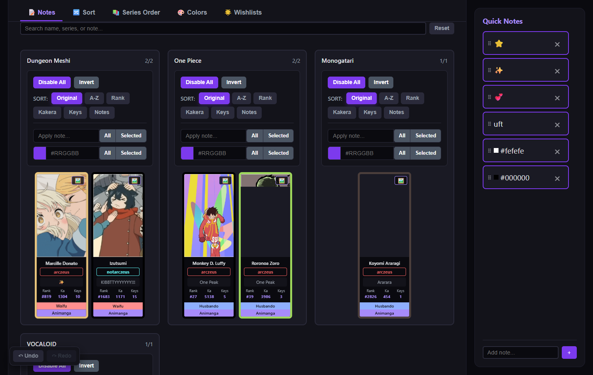

### 2. Reorder your whole collection

Head to the **Sort** tab, paste your `$mmmka+s` output, and drag characters (or jump one straight to a position) into the order you want. Generate a full `$sm` command, or a short `$smpos` for just the ones you moved.

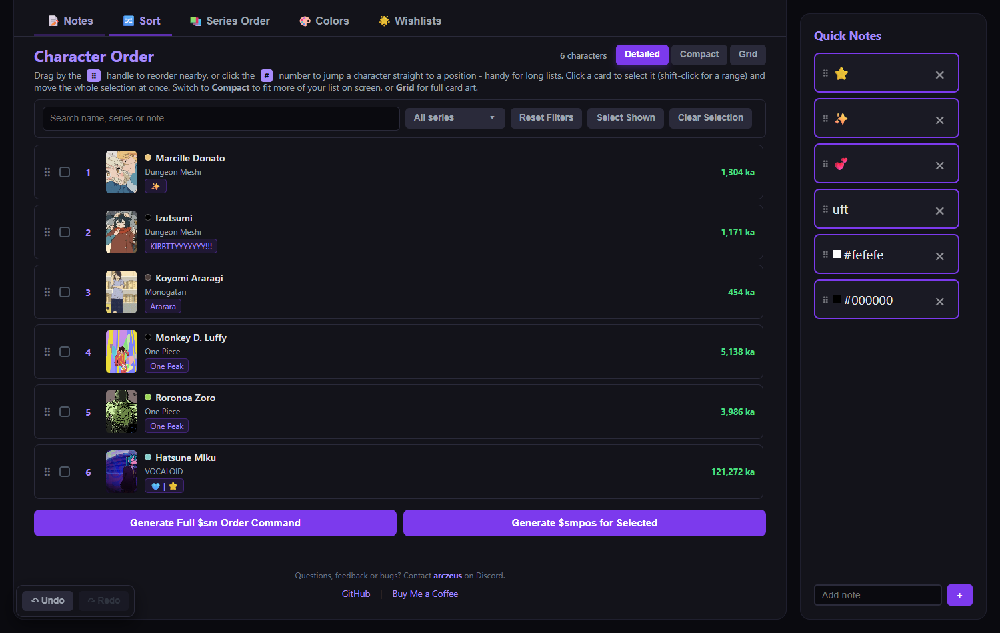

### 3. Reorder series

The **Series Order** tab works the same way, one level up - drag series into place and generate a `$smseries` command.

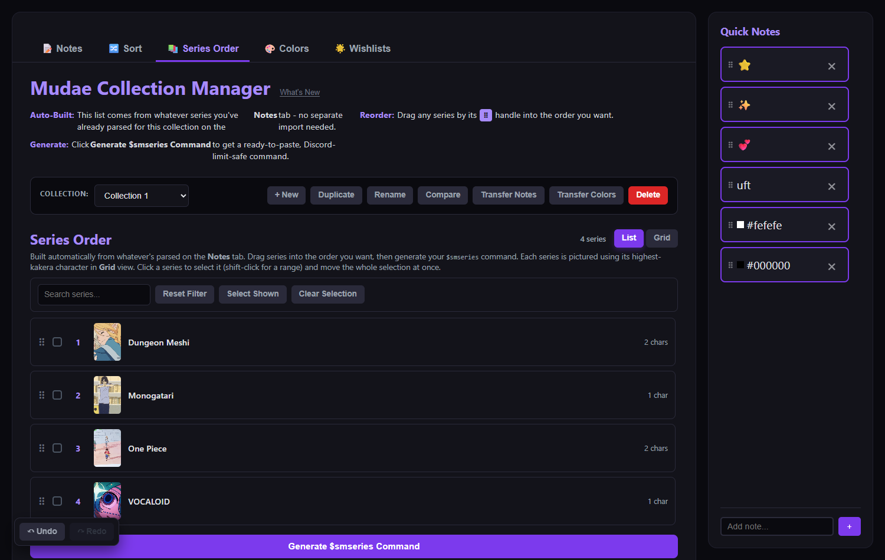

### 4. Pick colors visually

On the **Colors** tab, drag inside the wheel (or type a hex code), choose who it applies to, and generate a `$ec` command. The "Pick Characters" list is scoped to characters holding at least one key, with a "No Color Only" filter to find who still needs one.

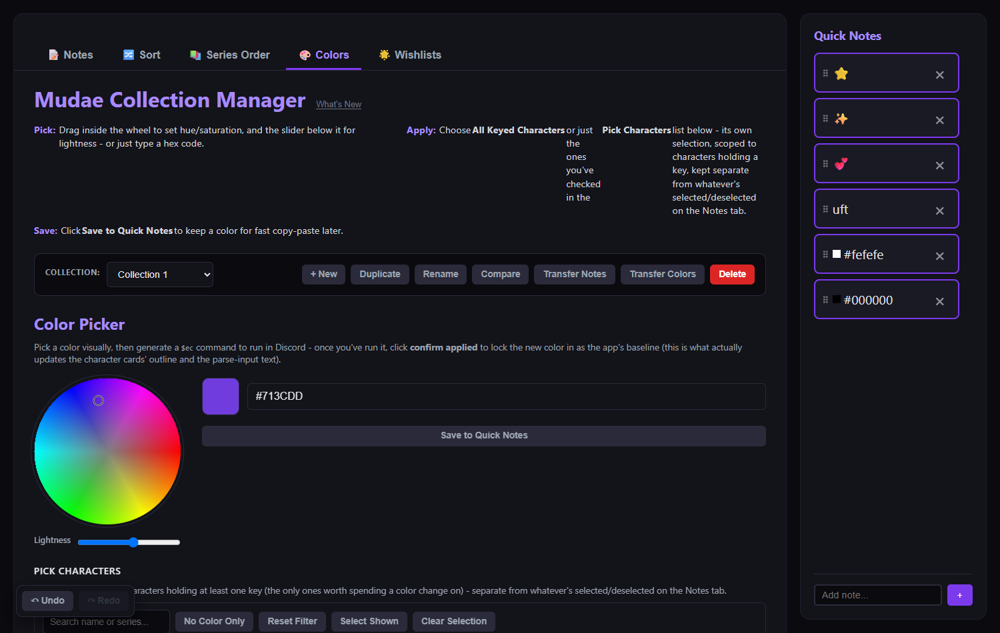

### 5. Change or add an image

Click the 🖼️ badge on any character's picture to generate an `$ims CharacterName` command. Mudae DMs back every image link already claimed for them - paste the whole DM in (numbers and all) and pick one visually from the thumbnail grid. Picking an image updates it here immediately, and shows the matching `$c CharacterName$N` command so you can make it the active image on Mudae too.

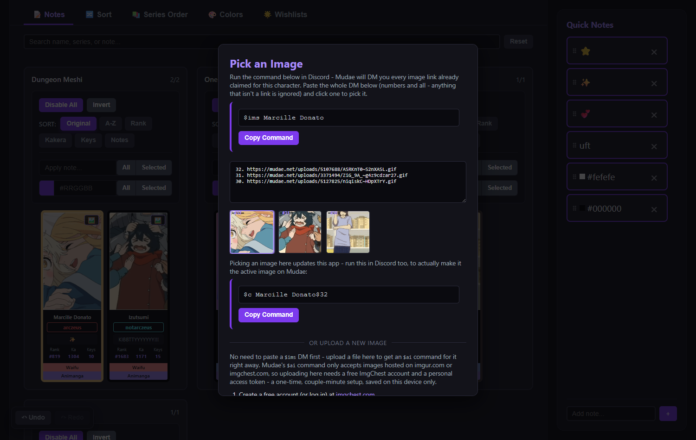

Need a brand-new image instead? The same modal has an upload section - a one-time ImgChest token setup, then upload a file to get both an `$ai` command (adds the image) and a `$c` command (makes it active), with a confirm button that updates the app once you've run them in Discord. There's also a built-in cropper (works on animated GIFs too) to get any image to Mudae's 225×350 size first.

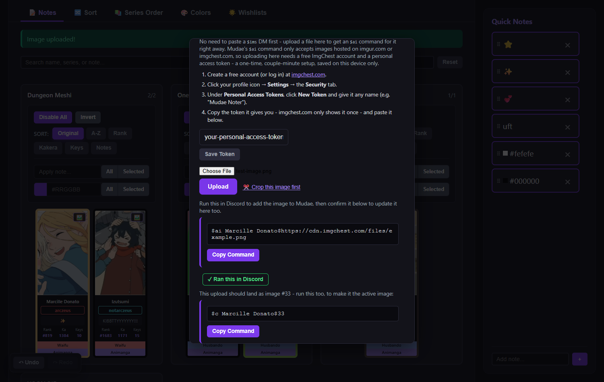
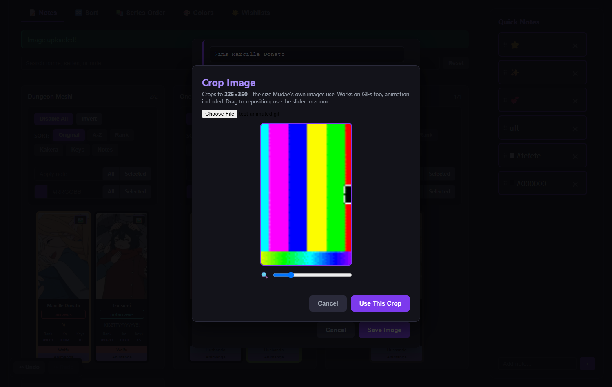

### 6. Track wishlists

On the **Wishlists** tab, run `$wishlist` in Discord (yours, or a friend's), paste the result in to save it, then compare any two saved wishlists to see the overlap - handy for trades.

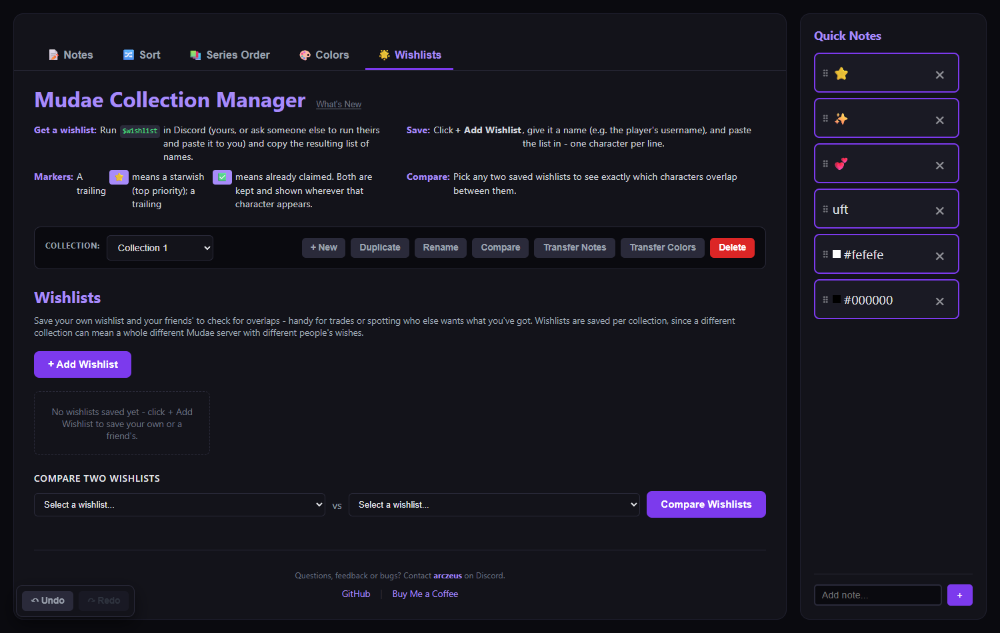

### 7. Custom Images and the built-in cropper

The **Custom Images** tab is a live gallery of every character currently using a non-mudae.net image. Below it, **Crop & Upload** lets you crop and upload a new image *before* deciding who it belongs to - upload or crop first, then search for a character to assign it to. The same cropper is also reachable per-row from the Imgur → ImgChest bulk transfer, for any image that needs resizing before it moves over.

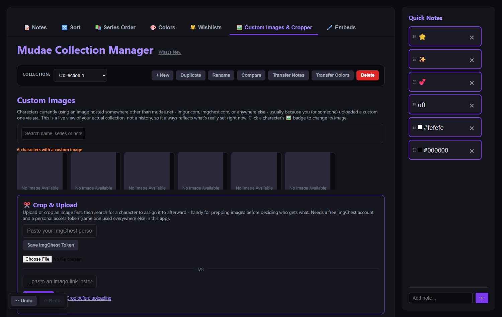

### 8. Customize your Discord embeds

The **Embeds** tab builds `$tuarrange`, `$arrangeim`, and `$profilearrange` - the three Mudae commands that control which categories show up in your `$tu`, `$im`/roll, and `$profile` embeds. Click categories to build the command (or start from **Reset to Default** and tweak from there), see a live best-effort preview of the result, and save/share layouts you like.

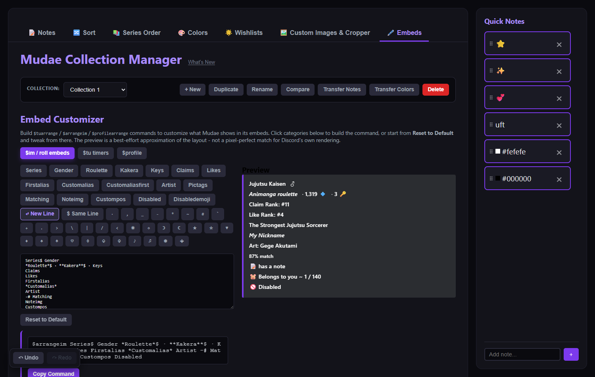

On desktop, a **Visual (drag & drop)** mode is also available alongside the text box: drag categories, line-breaks, and symbols onto a canvas to build the command instead of typing, and right-click any piece (or any selected text in the text box) to bold/italicize/underline it.

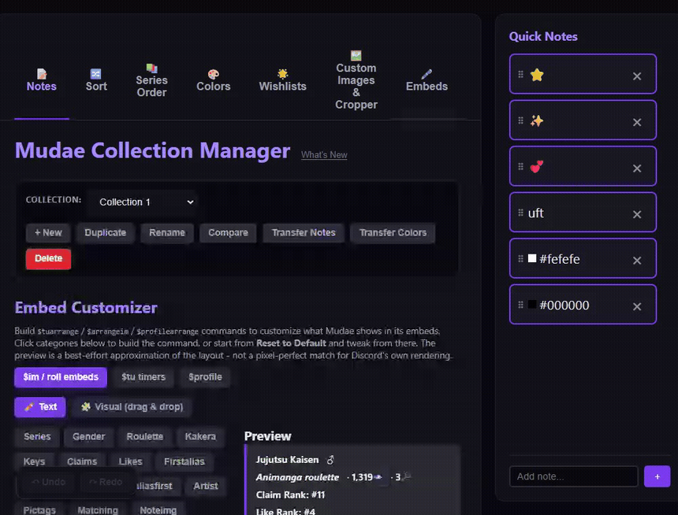

### Keeping up with changes

The app shows a "What's New" popup the first time it sees a new release, and you can reopen the full history any time from the link next to the title.

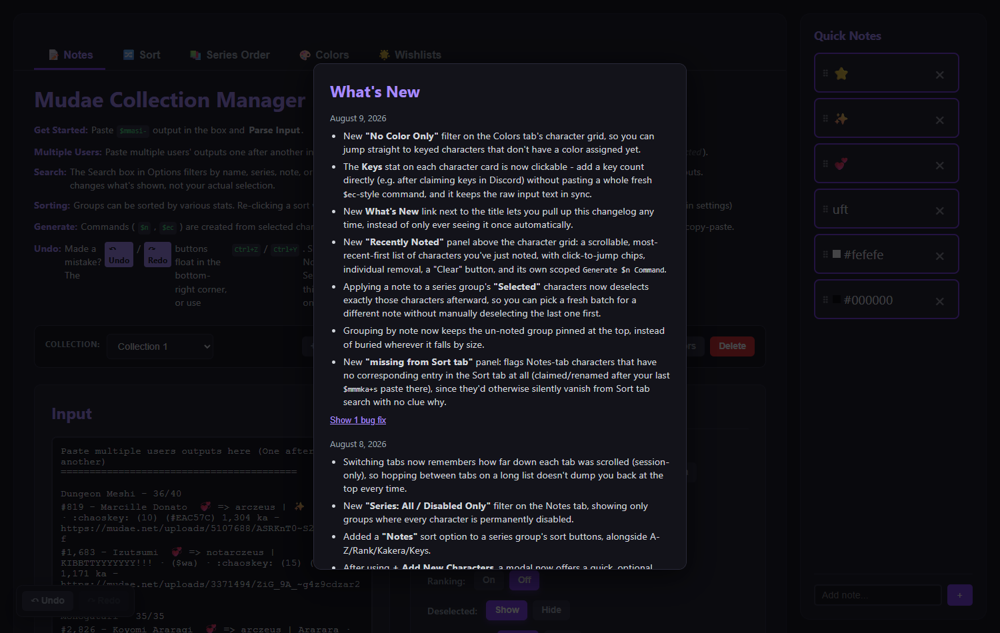

## Running It

**Hosted (recommended):** [mir-khan.github.io/mudae-noter](https://mir-khan.github.io/mudae-noter/) - just open it, nothing to install. All features work here, including image uploads.

**Locally:** download `index.html` and open it directly in your browser. Everything works the same way, with one caveat: the **Upload Image** feature makes a network request to ImgChest's API, and browsers are stricter about that from a local file than from a real website - if it doesn't work locally, use the hosted version for that feature, or upload at imgchest.com directly and paste the link in.

## Limitations

- Large collections (>5000 characters) may cause the page to slow down.
- The in-app **Upload Image** feature needs an ImgChest account and a free personal access token (see the in-app instructions) - each person needs their own, since ImgChest doesn't support a single shared login for this.

## Running Tests

`index.html` is a single static file with no build step, so the test suite drives it end-to-end in a real browser (via [Playwright](https://playwright.dev/)) rather than unit-testing pieces of it in isolation.

```
npm install
npm test
```

This launches whatever Chromium-based browser is installed (Edge or Chrome), loads `index.html` directly from disk, and runs through the app's tabs like a user would - loading the demo collection, applying filters, ranking, generating commands, picking colors, etc. If no supported browser is found, point `MUDAE_TEST_BROWSER_PATH` at one:

```
MUDAE_TEST_BROWSER_PATH="/path/to/chrome" npm test
```

Test files live in `tests/*.spec.js`, one per feature area. Add a new `*.spec.js` file (see the existing ones for the pattern) to cover new features or lock in a bug fix - `tests/run.js` picks up any file matching that name automatically.

## What's New in This Fork

Everything below was added on top of [Arczeus's original project](https://github.com/Arczeus/mudae-noter):

- **Multi-collection support** - create, duplicate, rename, delete, and switch between separate collections, each with its own saved state and its own Imgur-only filter + `$ai` command generator.
- **Compare & Transfer** - compare two collections to see what's only in one or the other, and generate commands to transfer notes or colors from matching characters in Collection A onto Collection B (color transfers require at least 1 key on both sides, so nothing gets applied to a character you don't actually own there).
- **Sort tab** - drag-and-drop or type-a-position reordering of your whole collection, with detailed/compact/grid views, search plus multi-select series filtering, multi-select drag-and-move, and `$sm`/`$smpos` command generation for both full reorders and small position-only fixes.
- **Series Order tab** - the same reordering/search/multi-select workflow, but for series instead of individual characters, with a cover-art grid view (each series pictured by its highest-kakera character) and `$smseries` command generation.
- **Undo/redo** - a floating Undo/Redo widget (plus `Ctrl+Z`/`Ctrl+Y`) that covers every change made anywhere in the app for the current session.
- **Notes search** - filter the character grid by name, series, note, or owner without touching your actual selections.
- **Color command chips** - generated `$ec` commands now show exactly which characters they cover, not just a count.
- **More reliable alias matching** - the Sort tab's `$mmmka+s` import falls back to matching characters by series + kakera value, so a character renamed with Mudae's `$alias` command still gets its notes/image/color pulled in correctly, and a "missing from Sort tab" indicator flags characters with no matching entry at all so nobody silently vanishes from Sort tab search.
- **Colors tab** - a canvas-based color wheel + lightness slider (or type a hex directly) for picking colors visually. Its "Pick Characters" list is its own grid scoped to keyed characters, fully independent from whatever's selected on the Notes tab, with a "No Color Only" filter to quickly find who's still uncolored.
- **Sort by Notes** - a section on the Notes tab that lists every note in use, lets you drag them into a priority order, and generates a `$smnote` command from it - the same drag/select workflow as Series Order, without leaving the Notes tab.
- **Quick Notes** - a sidebar of reusable notes/emojis/hex colors for fast copy-paste, reorderable by drag-and-drop, and available as click-to-fill chips in the new-character note prompt too.
- **Recently Noted panel** - applying a note to your selected characters deselects them afterward (so you can immediately pick the next batch for a different note), and this panel keeps a scrollable, most-recent-first list of who you just tagged, with click-to-jump chips, individual removal, a "Clear" button, and its own scoped `$n` command generator. Also picks up characters noted through the new-character prompt.
- **Click-to-add Keys** - click the Keys stat on any character card to add to their key count directly, without a `$ec`-style Discord round-trip.
- **`$ims` image picker** - click a character's picture to generate an `$ims CharacterName` command, paste the whole DM back in, and pick visually from a thumbnail grid instead of hunting for one link by hand. Each pick shows the matching `$c CharacterName$N` command, since `$ai` only adds an image to Mudae's pool - `$c` is what actually makes one active, by its number in that DM.
- **Upload Image (ImgChest)** - tied to whichever character the image picker is open for: upload a file to get an `$ai` command scoped to that character, with guided one-time token setup (Imgur no longer accepts new API app registrations, so this uses ImgChest instead). A confirm button applies the new image locally once you've run the command, and if you'd already pasted that character's `$ims` DM, a `$c` command is generated too (numbered one past the highest number seen), so the upload can be made active right away.
- **Image Cropper** - crops any image (or animated GIF, with the animation preserved frame-by-frame) to 225×350, the size Mudae's own images use, with drag-to-pan and zoom - reachable from the upload section, feeding straight back into it.
- **Mobile support** - the whole app is responsive and usable on a phone or tablet, not just desktop.
- **What's New link** - reopen the full changelog any time from a link next to the title, instead of only ever seeing it once automatically.
- **`$smseries`/`$smnote` length handling** - `$smseries` has no append/insert/continuation mode (confirmed against the real bot - it only accepts the complete order in one message), so these always generate a single command. If the full order is over Discord's 2,000-character limit but still fits under Nitro's 4,000, you get a warning plus a working command and a confirm button. If it's too long even for Nitro, the command is cut off at the last series/note that fits, with a clear note on how many were left out and a pointer to sort the rest manually.
- **+ Add New Characters** - a popup for adding just-claimed characters without re-pasting your entire collection: run `$mmsaty+ri-c+x+kon` (your usual import flags plus Mudae's `n` "not noted" flag) to DM yourself only your un-noted characters, paste that into the popup, and it merges them in - existing characters (matched by series + name) are left completely untouched, newly-added ones are slotted in by global rank (lower # first) rather than always landing last, and you can add a quick note to each new arrival right there.
- **Confirm order applied** - after generating a `$sm`/`$smseries`/`$smnote`/color command and running it in Discord, a "✓ Ran this in Discord" button lets you lock that order/color in as the app's new baseline (reordering or recoloring the underlying data to match), so later actions build on the real current state instead of the stale one from your last full import.
- **Wishlists tab** - save your own and other players' `$wishlist` output (paste it, name it) and compare any two side by side to see exactly which characters overlap. A trailing `⭐` (starwish) or `✅` (already claimed) in the pasted text is recognized and shown next to matching characters in the results. Wishlists are saved per collection, since a different collection can mean a whole different Mudae server with different people's wishes.
- **`$imsi-` instead of `$ims`** - the per-character image picker now generates `$imsi- CharacterName` (the `$im` command with its DM and "hide images" flags together) instead of plain `$ims`, so Mudae's response is a numbered text list you can paste in without every claimed image also popping up as a full embed in your DMs.
- **Custom Images tab + Crop & Upload** - a live gallery of every character currently using a non-mudae.net image, with its own "Crop & Upload" section: crop and/or upload an image before deciding who it belongs to, then search for a character to assign it to afterward - handy for prepping a batch of images ahead of time. The image cropper itself was also made more reliable by vendoring its GIF-encoding libraries directly into the app instead of loading them from a CDN at crop time, since some ad blockers/privacy extensions were silently blocking that request and making GIF cropping appear to just not work.
- **Bulk Imgur → ImgChest transfer, with per-row cropping** - migrate every imgur.com-hosted image in your collection to ImgChest at once (checked by default, deselect any you don't want), each with its own `$ai` command and confirm button. Any row can also be cropped to Mudae's 225×350 first via an optional "Crop first" button, without slowing down the rows you leave untouched.
- **Two-step `$ai`/`$c` confirm** - uploading a new image and confirming it used to close the picker modal right away even when a `$c` command was still waiting to be run to actually make the image active - easy to forget once the modal's gone. The `$c` command now gets its own confirm button too, and the modal only closes once both have been confirmed (when there's a `$c` command to confirm at all).
- **`$antidisable` command builder** - lists every series in your collection where every character is currently disabled (checked by default), and generates a single `$antidisable series1$series2$...` command to re-enable whichever ones you pick. Now Game Mode-aware: pick whether your server runs Mudae's Game Mode 1 or 2 right in the builder, since disabling works very differently between them (Mode 2 doesn't shrink your pool the way Mode 1 does), and Mode 2 also unlocks re-enabling individual characters, not just whole series, with a searchable list since a Mode 2 disable list can be huge.
- **Delete character(s)** - a 🗑️ badge on every character card/row (Notes and Sort tabs) deletes that one character; tap once to arm it, tap again to actually delete, since a plain confirmation popup doesn't really guard against an accidental tap (especially on mobile) the way a two-step badge does. Both tabs also support bulk delete - a dedicated selection on the Notes tab, and the Sort tab's existing selection - each behind a normal confirmation. Deleting the last character in a series removes the series too, and everything is undoable with the usual Undo button.
- **Embeds tab** - build `$tuarrange`/`$arrangeim`/`$profilearrange` commands (which categories Mudae shows in your `$tu`, `$im`/roll, and `$profile` embeds) by clicking categories into a text box instead of hand-typing Discord's syntax, with a live best-effort preview of the result (using real example art plus Mudae's own kakera/sphere/key icons) and the ability to save layouts (and share them with a friend via a copyable code) - saved globally, since your embed display preferences aren't tied to any one collection. On desktop, a **Visual (drag & drop)** mode is also available alongside the text box: drag categories, line-breaks, and symbols onto a canvas to build the command, and right-click any piece - or any selected text in the text box - to bold/italicize/underline it, instead of composing markdown by hand. A **Build Text** tool composes a whole decorative run (like a border) in one go instead of one symbol per click, chips can be copied and pasted to duplicate them, and its own Undo/Redo (plus a Clear Text button) covers edits made either way.
- **Optional border on the Image Cropper** - crop output can now include a colored border (white by default, since that's the slight edge Mudae's own images already pick up once Discord embeds them), with a live preview right in the cropper before you commit. Works for animated GIF crops too, drawn onto every frame.

## Why?

I wanted to add on to the functionality of the original app I used as I felt I needed something more than what the original tool was offering. So, I added some functionality I and others wanted alongside some functionalities I've seen on other websites.


